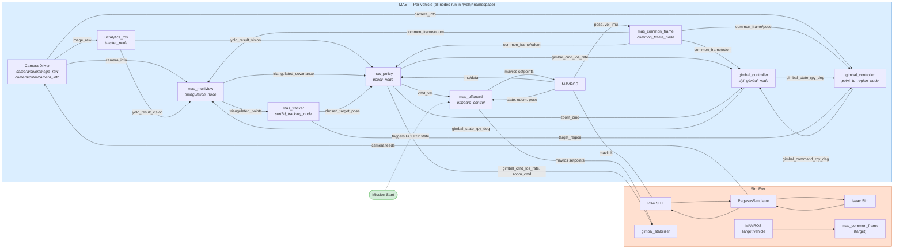

# MAS (Multi-Agent System) Architecture

Multi-agent drone observation system: 2D detection, multi-view triangulation, 3D tracking, gimbal control, and learned policy deployment. All ROS2 nodes run per-vehicle.

## Architecture Diagram



### Mission Phases

- **Before mission:** `point_to_region_node` computes gimbal angles from tracked target → `siyi_gimbal_node` actuates. `offboard_control` runs state machine (INIT→ARM→TAKEOFF→HOVER).
- **After mission start:** `offboard_control` enters POLICY state. `mas_policy` takes over: publishes `cmd_vel`, `gimbal_cmd_los_rate`, `zoom_cmd`.

## Topic/Service Interface

All topics below are per-vehicle, resolved within `/{veh}/` namespace unless noted.

| Topic | Msg Type | Publisher | Subscriber | QoS |
|-------|----------|----------|------------|-----|
| `image_raw` | sensor_msgs/Image | camera driver | ultralytics_ros | default |
| `camera/color/camera_info` | sensor_msgs/CameraInfo | camera driver | mas_multiview, point_to_region_node | default |
| `yolo_result_vision` | vision_msgs/Detection2DArray | ultralytics_ros | mas_multiview, mas_policy (ego) | BEST_EFFORT |
| `yolo_result_active` | std_msgs/Bool | ultralytics_ros | mas_policy (peers) | BEST_EFFORT |
| `common_frame/odom` | nav_msgs/Odometry | mas_common_frame | mas_multiview, mas_policy, siyi_gimbal_node | BEST_EFFORT |
| `common_frame/pose` | geometry_msgs/PoseStamped | mas_common_frame | point_to_region_node | BEST_EFFORT |
| `gimbal_state_rpy_deg` | geometry_msgs/Vector3 | siyi_gimbal_node (encoder 0x26) | mas_multiview, point_to_region_node | BEST_EFFORT |
| `gimbal_imu_rpy_deg` | geometry_msgs/Vector3 | siyi_gimbal_node (IMU 0x0D) | — (secondary, available if needed) | default |
| `camera/zoom` | std_msgs/Float64 | — | mas_multiview | default |
| `camera_pose` | geometry_msgs/PoseStamped | — | mas_multiview | default |
| `triangulated_points` | mas_msgs/TriangulatedPointArray | mas_multiview | mas_tracker | default |
| `{cam}/target_rays_w` | mas_msgs/TargetRayArray | mas_multiview | mas_multiview (peers), mas_policy | default |
| `tracked_objects/class_{i}` | vision_msgs/Detection3DArray | mas_tracker | — | default |
| `chosen_target_pose` | geometry_msgs/PoseWithCovarianceStamped | mas_tracker | mas_policy | default |
| `target_region` | geometry_msgs/PointStamped | mas_tracker | point_to_region_node | default |
| `gimbal_command_rpy_deg` | geometry_msgs/Vector3 | point_to_region_node | mas_mission (tracking input) | default |
| `gimbal_state_rpy_rad` | geometry_msgs/Vector3 | los_rate_controller | mas_policy (ego) | default |
| `combined_ang_vel_w` | geometry_msgs/Vector3Stamped | los_rate_controller / siyi_gimbal_node | mas_policy (peers) | BEST_EFFORT |
| `zoom_level` | std_msgs/Float32 | los_rate_controller / siyi_gimbal_node | mas_policy (ego + peers) | BEST_EFFORT |
| `/mission_state_cmd` | std_msgs/Int8 | Operator | mas_mission (all agents) | RELIABLE, transient local |
| `mission_state` | std_msgs/Int8 | mas_mission | offboard_control | RELIABLE, transient local |
| `cmd_vel` | geometry_msgs/TwistStamped | mas_mission | offboard_control | BEST_EFFORT |
| `gimbal_cmd_rpy_deg` | geometry_msgs/Vector3 | mas_mission | siyi_gimbal_node | default |
| `gimbal_cmd_los_rate` | geometry_msgs/Vector3 | mas_mission | los_rate_controller | default |
| `zoom_cmd` | std_msgs/Float32 | mas_mission | siyi_gimbal_node | default |
| `policy/cmd_vel` | geometry_msgs/TwistStamped | mas_policy | mas_mission | BEST_EFFORT |
| `policy/gimbal_cmd_los_rate` | geometry_msgs/Vector3 | mas_policy | mas_mission | default |
| `policy/zoom_cmd` | std_msgs/Float32 | mas_policy | mas_mission | default |
| `mavros/state` | mavros_msgs/State | MAVROS | offboard_control | RELIABLE |
| `mavros/local_position/pose` | geometry_msgs/PoseStamped | MAVROS | offboard_control | RELIABLE |
| `mavros/local_position/odom` | nav_msgs/Odometry | MAVROS | offboard_control | RELIABLE |
| `mavros/setpoint_velocity/cmd_vel` | geometry_msgs/TwistStamped | offboard_control | MAVROS | default |
| `mavros/setpoint_position/local` | geometry_msgs/PoseStamped | offboard_control | MAVROS | default |
| `mavros/imu/data` | sensor_msgs/Imu | MAVROS | mas_policy | default |

### Services

| Service | Type | Node | Notes |
|---------|------|------|-------|
| `mavros/cmd/arming` | mavros_msgs/CommandBool | offboard_control (client) | Arm/disarm |
| `mavros/set_mode` | mavros_msgs/SetMode | offboard_control (client) | Set OFFBOARD mode |
| `~/reset_hidden_state` | std_srvs/Trigger | mas_policy | Reset GRU hidden states |

## Parameters

| Parameter | Type | Default | Node | Description |
|-----------|------|---------|------|-------------|
| `vehicle_name_prefix` | string | `"px4_"` | common_frame_node | Vehicle namespace prefix |
| `num_vehicles` | int | `2` | common_frame_node | Number of vehicles |
| `common_frame_origin` | float[] | `[37.7749, -122.4194, 0.0]` | common_frame_node | GPS origin [lat, lon, alt] |
| `yolo_model` | string | `"yolov8n.pt"` | tracker_node | YOLO model file |
| `conf_thres` | double | `0.25` | tracker_node | Detection confidence threshold |
| `publish_rate` | double | `10.0` | triangulation_node | Triangulation rate (Hz) |
| `num_camera` | int | `3` | triangulation_node | Number of cameras |
| `camera_name_prefix` | string | `"/px4_"` | triangulation_node | Prefix for per-camera topics |
| `max_reprojection_error` | double | `100.0` | triangulation_node | Max reprojection error (px) |
| `use_precomputed_rays` | bool[] | `[]` | triangulation_node | Per-camera: subscribe to target_rays_w instead of raw topics |
| `association_distance_threshold` | double | `1.0` | sort3d_tracking_node | Track association threshold |
| `max_track_age` | int | `30` | sort3d_tracking_node | Frames before track deletion |
| `server_ip` | string | `"192.168.144.25"` | siyi_gimbal_node | SIYI gimbal IP |
| `publish_rate_hz` | double | `25.0` | siyi_gimbal_node | Gimbal state publish rate |
| `enable_encoder_stream` | bool | `true` | siyi_gimbal_node | Enable magnetic encoder angle streaming (0x26) |
| `enable_aircraft_attitude` | bool | `true` | siyi_gimbal_node | Enable aircraft EKF attitude injection (0x22) |
| `encoder_stream_freq` | int | `50` | siyi_gimbal_node | Encoder angle stream frequency (Hz) |
| `vehicle_name` | string | `""` | offboard_control | Vehicle namespace prefix |
| `update_rate` | float | `100.0` | offboard_control | Timer callback frequency (Hz) |
| `target_system` | int | `1` | offboard_control | PX4 MAVLink system ID |
| `position.x/y/z` | float | `0.0` | offboard_control | Waypoint position (ENU, m) |
| `position.yaw_deg` | float | `0.0` | offboard_control | Waypoint yaw (degrees) |
| `takeoff_speed` | float | `3.0` | offboard_control | Climb rate (m/s) |
| `checkpoint_path` | string | `""` | policy_node | Path to SKRL .pt checkpoint |
| `num_agents` | int | `2` | policy_node | Number of agents |
| `vehicle_names` | string[] | `["px4_1","px4_2"]` | policy_node | Vehicle namespace prefixes |
| `architecture` | string | `"mappo_rnn"` | policy_node | Policy network type |
| `control_frequency` | double | `25.0` | policy_node | Inference loop rate (Hz) |
| `enable_cbf` | bool | `true` | policy_node | Enable CBF inter-agent safety filter |

## Node Isolation

**Standalone** (no inter-package topic dependencies):
- `mas_common_frame/common_frame_node` — only needs MAVROS topics
- `ultralytics_ros/tracker_node` — only needs camera images
- `gimbal_controller/siyi_gimbal_node` — needs gimbal command topic + common_frame/odom (for aircraft attitude injection)
- `mas_offboard/offboard_control` — only needs MAVROS topics + `cmd_vel`

**Has dependencies** (connected via topics):
- `mas_multiview/triangulation_node` — needs detections, odom, camera info, gimbal state, zoom (from all vehicles)
- `mas_tracker/sort3d_tracking_node` — needs triangulated markers
- `gimbal_controller/point_to_region_node` (before mission) — needs target, pose, camera info, gimbal state
- `mas_policy/policy_node` (after mission start) — needs ego odom/IMU/gimbal/detections + peer odom/gimbal/detections + triangulation

## Package Summary

| Package | Build Type | Nodes | Role |
|---------|-----------|-------|------|
| `mas_msgs` | ament_cmake | — (messages only) | Shared message types (TriangulatedPointArray, TargetRayArray) |
| `ultralytics_ros` | ament_cmake (hybrid) | tracker_node, tracker_with_cloud_node | 2D/3D YOLO detection |
| `mas_common_frame` | ament_python | common_frame_node, common_frame_node_single | GPS→common frame transforms |
| `mas_multiview` | ament_cmake | triangulation_node | Multi-view triangulation (C++, Ceres) |
| `mas_tracker` | ament_cmake | sort3d_tracking_node | 3D multi-object tracking (SORT) |
| `gimbal_controller` | ament_python | siyi_gimbal_node, point_to_region_node | Gimbal hardware + pointing |
| `mas_policy` | ament_python | policy_node | MARL policy inference + CBF safety |
| `mas_mission` | ament_python | mission_node | Mission state machine + command routing |
| `mas_offboard` | ament_python | offboard_control | Per-vehicle PX4 offboard controller |

## Launch System

The system uses **tmuxp** session files for deployment. Each tmuxp file defines a tmux session with multiple windows, one per node group.

### ROS2 Environment

| Workspace | Path | ROS2 Distro | Contents |
|-----------|------|-------------|----------|
| Humble (base) | `~/ros2_humble/install` | Humble | Core ROS2, vision_msgs, mavros_msgs, geographic_msgs |
| IsaacPX4 | `~/IsaacPX4/ros2_ws/install` | Humble | gimbal_stabilizer (los_rate_controller) |
| MAS | `~/mas/install` | Humble | All MAS packages (mas_msgs, mas_multiview, mas_policy, etc.) |
| Galactic (system) | `/opt/ros/galactic` | Galactic | MAVROS node only (separate process) |

Most nodes source humble + MAS workspace. MAVROS runs from the galactic system package in its own process (galactic/humble interop works across processes via DDS).

### Simulation (3 agents: px4_1, px4_2 ego + px4_3 target)

Launch order matters — simulator must start before drone sessions.

**Step 1: Simulator + gimbal controllers**
```bash
tmuxp load ~/IsaacPX4/tmux/isaac_sim.tmuxp.yaml
# Headless: append --headless to the isaac.py command in the yaml
```
Starts: Isaac Sim + PegasusSimulator (auto-launches 3x PX4 SITL), gimbal_stabilizer (3x los_rate_controller), QGroundControl.

Wait for `Ready for takeoff!` in the simulator pane before proceeding.

**Step 2: Per-agent drone sessions**
```bash
tmuxp load tmux/simdrone1.tmuxp.yaml   # px4_1 + multi-vehicle nodes
tmuxp load tmux/simdrone2.tmuxp.yaml   # px4_2 per-vehicle only
tmuxp load tmux/simdrone3.tmuxp.yaml   # px4_3 (target) per-vehicle only
```

**Step 3 (optional): Multiview triangulation + tracking**
```bash
tmuxp load tmux/multiview.tmuxp.yaml   # triangulation_node + sort3d + common_frame + YOLO + point_to_region
```

**Step 4: Operator commands** (via ros2 topic pub or `scripts/operator.py`)
```bash
python3 scripts/operator.py
# Or manually:
ros2 topic pub /mission_state_cmd std_msgs/Int8 "data: 1" --qos-durability transient_local --qos-reliability reliable
```

### Session Layout

| Session | File | Windows | Scope |
|---------|------|---------|-------|
| `isaac_sim` | `~/IsaacPX4/tmux/isaac_sim.tmuxp.yaml` | simulator, ros2 (gimbal_stabilizer), util (QGC) | Sim environment |
| `drone1` | `tmux/simdrone1.tmuxp.yaml` | mavros, frame, camera, mission, offboard, policy, tracker | px4_1 per-vehicle + multi-vehicle deploy nodes |
| `drone2` | `tmux/simdrone2.tmuxp.yaml` | mavros, frame, camera | px4_2 per-vehicle only |
| `drone3` | `tmux/simdrone3.tmuxp.yaml` | mavros, frame, camera | px4_3 per-vehicle only |
| `multiview` | `tmux/multiview.tmuxp.yaml` | triangulation, detection, gimbal_pointing_control | Triangulation + tracking (standalone) |

### Node Categories

**Per-vehicle** (one instance per agent, runs in `/{veh}/` namespace):
- `mavros_node` — MAVLink bridge (galactic)
- `common_frame_node_single` — GPS to common frame
- `tracker_node.py` — YOLO detection
- `point_to_region_node` — gimbal pointing

**Multi-vehicle deploy** (one launch spawns instances for ALL vehicles, configured via `vehicles.yaml`):
- `mission_deploy.launch.py` — mas_mission (one node per vehicle)
- `offboard.launch.py` — mas_offboard (one node per vehicle)
- `policy_deploy.launch.py` — mas_policy (one node per vehicle)
- `sort3d.launch.py` — mas_tracker (one node)
- `triangulation.launch.py` — mas_multiview (one node, subscribes to all cameras)

### PX4 SITL Port Mapping

| Vehicle | Namespace | PX4 Instance | MAVROS fcu_url | tgt_system |
|---------|-----------|-------------|----------------|------------|
| Drone 1 | `px4_1` | 1 | `udp://:14541@localhost:14551` | 2 |
| Drone 2 | `px4_2` | 2 | `udp://:14542@localhost:14552` | 3 |
| Drone 3 | `px4_3` | 3 | `udp://:14543@localhost:14553` | 4 |

### Teardown
```bash
tmux kill-session -t drone1; tmux kill-session -t drone2; tmux kill-session -t drone3; tmux kill-session -t isaac_sim
```

## File Conventions

- `CONTEXT.md` per package — node routing contracts (topics, services, parameters)
- `config/*.yaml` — parameter files
- `launch/*.launch.py` — launch files
- `doc/*_spec.md` — authoritative specifications
