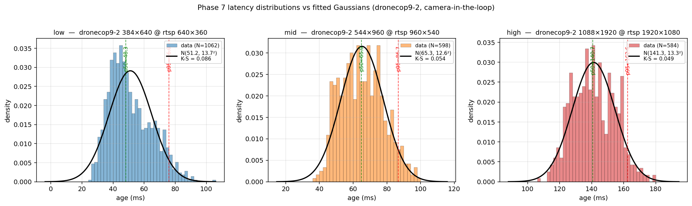

## Ticket: YOLO tracker latency tune

**What**: Systematically measure and reduce end-to-end latency from
`rtsp_camera` image publish → `ultralytics_ros` detection publish for
the drone-ISR path. Produce a sweep CSV and commit the winning launch
defaults.

**Why**: Ticket 031 closed out the upstream (rtsp → ROS2) portion at
~245 ms glass-to-topic p50, ~85% of which is the A8 encoder + RTSP
transit (not ours). Separately measured, the tracker leg itself adds
~297−(245+16)=~36 ms of inference + queue + publish on `yolov11n.pt`.
We now:
- switched to the faster FP16 TensorRT path (`.engine` variants
  exported with `half=True` for n/s/m/l/x),
- will likely use `yolov11m-drone.engine` for accuracy headroom, which
  costs more GPU time per frame than `n`,
- still have a 5-deep image subscription queue at the tracker, so any
  rate mismatch between rtsp_camera and YOLO inference fills the queue
  and adds ~(queue_depth / infer_rate)×1000 ms of staleness on top of
  the pure inference time.

The goal of this ticket is to (a) make the queue backlog go away
structurally, (b) quantify every tunable knob on the tracker node, and
(c) pick the Pareto-best (model × imgsz × camera resolution) triple
against a measured latency target.

---

## Scope

### Phase 0 — Instrumentation and required code edits
Prerequisites to all measurement. Not ablated; applied once and kept.

- MOD: [src/ultralytics_ros/script/tracker_node.py](../../../../ultralytics_ros/script/tracker_node.py) —
  - Image subscription QoS: explicit `QoSProfile(history=KEEP_LAST,
    depth=1, reliability=BEST_EFFORT)` on both raw and compressed
    subscribers (replaces `qos_profile_sensor_data`, which is depth=5).
    This is the structural fix for the 200 ms queue backlog described
    in ticket 031.
  - Cache parameters in `__init__`. The current node calls
    `get_parameter(...)` 11× per frame (5× in `image_callback`, 6× in
    `create_result_image`). Parameters here are launch-time
    configuration, not runtime-tunable state.
  - Gate the annotated-image work on `result_image_pub.get_subscription_count() > 0`.
    `results[0].plot(...)` is ~5–15 ms CPU per frame (PIL text render +
    box draw); wasted whenever no one is viewing the annotated topic.
    Same pattern [rtsp_camera uses](../../../../rtsp_camera/src/rtsp_camera_node.cpp#L284-L299).
  - `retina_masks` → `self.use_segmentation` (currently hardcoded
    `True`; has no effect on detection models but is a small tensor
    op on seg models).
  - Inference timing: wrap `self.model.track(...)` with
    `time.perf_counter()` and log rolling p50/p95 every 60 frames.

- NEW: `src/scripts/stamp_age.py` — generic header-age probe.
  Subscribes to any topic whose type has a `.header` (or `.detections[0].header`)
  field, records `t_received − header.stamp` per message, streams to
  CSV (same format as [latency_measurement.py](../../../../scripts/latency_measurement.py)),
  prints rolling p50/p95 every 5 s. This is the metric used in
  ticket 031's phase-2 tables. We use it on `/yolo_result_vision` to
  measure image-stamp → detection-publish age across the sweep.

- REUSE: [src/scripts/latency_measurement.py](../../../../scripts/latency_measurement.py)
  + [latency_clock_display.py](../../../../scripts/latency_clock_display.py).
  These remain the glass-to-topic end-to-end measurement. The
  tracker tuning moves the `age` component; combined with the known
  ~245 ms upstream portion, the two together give the absolute
  glass-to-detection number.

### Phase 1 — Baseline

Launch the current drone.tmuxp.yaml configuration (rtsp_camera @
960×540 avdec_h264, tracker with `yolov11m-drone.engine` defaults).
Run 60 s and record:

| Metric | Source |
|---|---|
| Image-publish rate | `ros2 topic hz /px4_2/camera/color/image_raw/compressed` |
| Detection-publish rate | `ros2 topic hz /px4_2/yolo_result_vision` |
| Inference ms p50/p95 | tracker_node.py new log |
| `age` p50/p95 at `/px4_2/yolo_result_vision` | `stamp_age.py` CSV |
| Glass-to-detection p50 (optional) | QR clock + glass-to-topic on image, add inferred `age` |

This baseline (v11m, 640 imgsz, defaults) is the reference every
knob tweak compares against.

**Measured baseline (2026-04-17, `yolov11m-drone.engine`, Phase-0
code, launch defaults, `rtsp_camera` 960×540 `avdec_h264`, live A8):**

| Metric | Value |
|---|---|
| Samples / duration | 1,277 / 91.3 s |
| Detection rate | 14.0 Hz |
| Inference p50 / p95 (tracker log) | 54 / 68 ms |
| `age` p50 / p95 / p99 | **92.5 / 121.0 / 136.4 ms** |
| `age` mean ± std | 92.8 ± 15.9 ms |
| `age` min / max | 60.8 / 161.5 ms |
| CSV | `/tmp/032/phase1_v11m_baseline.csv` |

Decomposition: inference 54 ms + ~38 ms non-inference overhead
(rtsp→tracker sub + JPEG decode + ByteTrack + message assembly + DDS
+ probe wake).

**Versus pre-Phase-0 (ticket 031, yolov11n):** `age` p50 dropped
297 → 92.5 ms while the model grew from `n` to `m`. The ~200 ms
queue-backlog component was removed by the depth=1 image-subscription
fix. Implied glass-to-detection p50 ≈ 337 ms (adding ticket 031's
measured ~245 ms A8 + RTSP upstream).

### Phase 2 — Single-knob ablation (launch / code knobs)

One variable at a time, 60 s run each, compared to the Phase 1
baseline. Accept a tweak if it reduces `age` p50 by ≥ 5 ms without
visible accuracy regression on the annotated image.

**A. Launch-param knobs** (no rebuild):

| Knob | Baseline | Sweep values | Mechanism |
|---|---|---|---|
| `max_det` | 300 | 2, 1 | NMS output cap. Drone scenes are single-target here; both values are aggressive floors to see whether NMS-output cost matters at all. |
| `conf_thres` | 0.25 | 0.25, 0.35, 0.45 | NMS input filter |
| `iou_thres` | 0.45 | 0.45, 0.6 | NMS merge threshold |
| `classes` | 0-79 | drone-only class id | post-filter cost |

Tracker choice (`bytetrack.yaml` vs others) is *not* ablated — ByteTrack
IDs are consumed downstream by Sort3D/mas_multiview, so swapping the
tracker changes system behaviour and isn't a pure-latency comparison.

**B. Code-side knobs** (tracker_node.py):

| Knob | Mechanism |
|---|---|
| `cv2.imdecode` → `PyTurboJPEG.decode` | JPEG decompress is ~5-7 ms on Jetson; turbojpeg ~1-2 ms |
| Warm-up inference at node start | removes first-inference spike from steady-state |

`.track()` → `.predict()` is *not* ablated for the same reason as the
tracker axis above: persistent IDs are load-bearing downstream.

**Measured Phase 2 (2026-04-17, v11m baseline + single-knob override,
60 s each, live A8, CSVs at `/tmp/032/phase2_*.csv`):**

| run | N | rate | p50 | p95 | p99 | Δp50 |
|---|---:|---:|---:|---:|---:|---:|
| baseline_reconfirm | 804 | 13.6 Hz | 94.0 | 131.4 | 148.9 | — |
| max_det=2 | 821 | 13.9 Hz | 92.7 | 124.2 | 138.3 | −1.3 |
| max_det=1 | 810 | 14.1 Hz | 92.8 | 125.0 | 140.4 | −1.1 |
| conf_thres=0.35 | 818 | 13.8 Hz | 93.6 | 128.2 | 144.4 | −0.3 |
| conf_thres=0.45 | 810 | 13.7 Hz | 93.5 | 128.9 | 149.0 | −0.4 |
| iou_thres=0.6 | 777 | 13.5 Hz | 94.9 | 127.1 | 142.9 | +0.9 |
| classes=[0] | 777 | 13.5 Hz | 94.5 | 129.6 | 145.8 | +0.5 |

**All Δp50 values are within ±1.3 ms, below the ≥5 ms acceptance
threshold and below run-to-run noise** (baseline_reconfirm itself
drifted +1.5 ms vs Phase 1's 92.5 ms). No knob accepted.

**Why** (for the model × scene in play):
- `yolov11m-drone.pt` is single-class (`{0: 'drone'}`) → `classes=[0]`
  filter is a no-op on already-filtered data.
- Scene has ~1-5 pre-NMS candidates → capping `max_det` at 1/2
  removes near-zero NMS work.
- Inference (54 ms p50) is dominated by conv layers. NMS + post ≈
  1-2 ms, below the noise floor of a 60 s sample.

Tail knobs are similarly flat: `max_det=2` tightens p99 by ~10 ms but
we're chasing a ~5 ms-noisy signal.

### Phase 3 — Best-combo retest

**Skipped** — Phase 2 produced no winners to combine. The combined
"best config" collapses to the Phase 1 baseline.

### Phase 4 — Model × imgsz × upstream-resolution matrix

Using the best-combo config from Phase 3.

**Prerequisite: re-export engines at smaller imgsz:**

```bash
for m in n s m; do
  for s in 480 320; do
    yolo export model=yolov11${m}-drone.pt format=engine half=True imgsz=${s}
    mv yolov11${m}-drone.engine yolov11${m}-drone-imgsz${s}.engine
  done
done
```

Existing `yolov11{n,s,m}-drone.engine` files are the imgsz=640 baseline.

**Main sweep (9 runs), rtsp_camera fixed at 960×540:**

| | imgsz=640 | imgsz=480 | imgsz=320 |
|---|---|---|---|
| **yolov11n-drone** | | | |
| **yolov11s-drone** | | | |
| **yolov11m-drone** | | | |

Record: inference ms p50/p95, `age` p50/p95, detection Hz, mAP vs GT.

**Upstream ablation (3 extra runs)** at the winning cell, vary
rtsp_camera output size on [drone.tmuxp.yaml:53-54](../../../../tmux/drone.tmuxp.yaml#L53-L54):

| rtsp W×H | JPEG bytes/frame (est.) | expected effect |
|---|---|---|
| 960×540 | ~180 KB | baseline |
| 640×360 | ~90 KB | −JPEG/DDS/decode cost |
| 480×270 | ~60 KB | more savings, mAP regression expected |

Isolates upstream transport cost from engine cost. If 960→640 step
doesn't move `age` p50, we're compute-bound and should stay at 960.

**Measured Phase 4 (2026-04-17, 3 models × 3 rtsp resolutions, 60 s
each, `phase4_sweep.py`, CSVs at `/tmp/032/phase4_*.csv`):**

| cell | N | rate | age p50 | p95 | p99 | infer p50/p95 |
|---|---:|---:|---:|---:|---:|---:|
| n_960x540 | 920 | 15.6 Hz | 81.9 | 111.7 | 123.4 | 44.6 / 66.8 |
| n_640x360 | 1119 | 19.7 Hz | 68.0 | 95.2 | 106.4 | 38.0 / 58.3 |
| n_480x270 | 1122 | 18.9 Hz | 70.5 | 97.7 | 109.8 | 42.1 / 58.2 |
| s_960x540 | 851 | 14.4 Hz | 88.6 | 122.9 | 139.6 | 51.3 / 68.5 |
| s_640x360 | 1092 | 18.4 Hz | 71.6 | 99.3 | 109.2 | 41.1 / 57.7 |
| s_480x270 | 1066 | 18.1 Hz | 74.2 | 99.5 | 112.2 | 44.3 / 60.8 |
| m_960x540 | 777 | 13.6 Hz | 93.8 | 126.6 | 141.5 | 53.4 / 73.0 |
| **m_640x360** | **1220** | **21.5 Hz** | **61.4** | **86.6** | **100.2** | **36.5 / 51.8** |
| m_480x270 | 1005 | 17.6 Hz | 76.0 | 104.7 | 117.4 | 46.6 / 62.2 |

**Winner: `m_640x360`** — age p50 **61.4 ms**, detection rate **21.5 Hz**
(pegged at rtsp_camera's ~22 Hz compressed ceiling — inference no
longer bottlenecks the pipeline). Vs Phase 1 baseline (m_960×540,
age p50 92.5 ms, 14 Hz): **−31 ms age, +54% rate, same model**.

**Why 640×360 wins the inside column for every model:**
`.engine` files were exported at `imgsz=640`. Ultralytics letterboxes
any input to a 640² canvas:
- 960×540 → downscale (extra cv::resize)
- 640×360 → vertical pad only (near-free, width already matches)
- 480×270 → upscale (extra cv::resize)

The pre-processing delta dominates: `m_640x360` infer p50 (36.5 ms)
undercuts `n_960x540` (44.6 ms) despite `m` being a ~5× bigger model.

### Phase 5 — Larger-model extension (`l`, `x`)

Extends Phase 4 with the two bigger drone-specific engines so the
Pareto frontier covers the full ultralytics size ladder:

- `yolov11l-drone.engine`
- `yolov11x-drone.engine`

Same 3 rtsp resolutions (960×540, 640×360, 480×270), same probe, same
60 s per cell. Runner: [src/scripts/phase5_sweep.py](../../../../scripts/phase5_sweep.py).
Six additional cells; CSVs at `/tmp/032/phase5_*.csv` so Phase 4's
files are untouched. Combined with Phase 4 this gives a full
5-model × 3-resolution = 15-cell matrix.

**Measured Phase 5 (2026-04-17, l/x × 3 rtsp resolutions, 60 s each,
`phase5_sweep.py`, CSVs at `/tmp/032/phase5_*.csv`):**

| cell | N | rate | age p50 | p95 | p99 | infer p50/p95 |
|---|---:|---:|---:|---:|---:|---:|
| l_960x540 | 752 | 12.8 Hz | 98.6 | 135.9 | 150.0 | 59.2 / 77.0 |
| l_640x360 | 1043 | 17.6 Hz | 74.5 | 100.0 | 111.8 | 45.6 / 60.0 |
| l_480x270 | 924 | 15.7 Hz | 82.1 | 111.9 | 129.2 | 54.5 / 74.5 |
| x_960x540 | 621 | 10.5 Hz | 119.6 | 158.1 | 175.7 | 78.4 / 93.9 |
| x_640x360 | 681 | 11.6 Hz | 103.8 | 132.9 | 149.1 | 73.7 / 86.9 |
| x_480x270 | 690 | 11.6 Hz | 104.4 | 134.2 | 145.6 | 76.6 / 88.6 |

`m_640x360` remains the overall latency winner across all 15 cells
(Phase 4 + Phase 5). `l` adds +13 ms, `x` adds +42 ms on `age` p50.
Every row is U-shaped with 640×360 as the sweet spot.

### Phase 6 — Custom rectangular `imgsz` engines

The U-shape hints every input size pays a pre-proc / padding tax
against the square 640² engine canvas. Three custom-imgsz re-exports
per model, each matched to an rtsp output shape:

| rtsp W×H | engine imgsz (H, W) | pad | canvas pixels | vs imgsz=640 (409k) |
|---|---|---:|---:|---:|
| 640×360 | (384, 640) | 24 rows vertical | 246k | −40% |
| 960×540 | (544, 960) | 4 rows vertical | 522k | +28% |
| 1920×1080 | (1088, 1920) | 8 rows vertical | 2089k | +410% |

Constraint: ultralytics stride=32, each dim a multiple of 32. 540→544,
360→384, 1080→1088. Lossless in all cases.

**Baseline engine rename** (done): the existing imgsz=640 square
engines were renamed `yolov11{n,s,m,l,x}-drone-640x640.engine` so
`yolo export` (which writes to `<modelbase>.engine` by default) does
not overwrite the Phase 1–5 reference engines. Scripts
[phase4_sweep.py](../../../../scripts/phase4_sweep.py) /
[phase5_sweep.py](../../../../scripts/phase5_sweep.py), the
[drone.tmuxp.yaml](../../../../tmux/drone.tmuxp.yaml) commented
tracker invocation, and `install/share` all track the new names.

**Scope trim**: `n` and `x` dropped from Phase 6 — `n` is off the
accuracy Pareto at any rtsp resolution, `x` is off the latency Pareto
and becomes impractical at 1080p. Kept: `{s, m, l}` yolov11-drone +
`dronecop9-2` (a 2-class drone+bird detector at ~22M params, similar
size to `s`). 4 models × 3 imgsz = 12 cells.

**Re-exports** — [src/ultralytics_ros/models/export_engines.sh](../../../../ultralytics_ros/models/export_engines.sh),
~3-5 min per engine, ~50 min total:

```bash
cd src/ultralytics_ros/models
./export_engines.sh
cd ../../..
colcon build --packages-select ultralytics_ros
```

**Sweep** — [src/scripts/phase6_sweep.py](../../../../scripts/phase6_sweep.py),
12 cells × (20 s warmup + 60 s probe + 3 s teardown) ≈ 17 min:

- `*-384x640.engine` at rtsp 640×360
- `*-544x960.engine` at rtsp 960×540
- `*-1088x1920.engine` at rtsp 1920×1080

CSVs at `/tmp/032/phase6_*.csv`, same probe protocol as Phase 4 / 5.

**Expected wins** (if pre-proc is the bottleneck as the Phase 4
alignment analysis suggested): m_384x640 below the current 61.4 ms
winner; m_544x960 competitive with the current m_640x360 result
since it trades resize cost for larger inference canvas.

**Measured Phase 6 (2026-04-17, 4 models × 3 rtsp+engine pairs,
60 s each, `phase6_sweep.py`, CSVs at `/tmp/032/phase6_*.csv`):**

Age p50 (ms), matched (engine, rtsp) pairs:

| model | 384×640 (rtsp 640×360) | 544×960 (rtsp 960×540) | 1088×1920 (rtsp 1920×1080) |
|---|---:|---:|---:|
| **dronecop9-2** | **46.8** | 68.9 | 164.1 |
| s | 69.9 | 86.5 | 150.0 |
| m | 76.4 | 92.1 | 208.2 |
| l | 79.0 | 89.9 | 239.2 |

Inference p50 (ms) / detection rate (Hz):

| model | 384×640 | 544×960 | 1088×1920 |
|---|---:|---:|---:|
| **dronecop9-2** | **28.8 / 24.0 Hz** | 38.1 / 16.8 | 84.5 / 8.2 |
| s | 39.5 / 19.0 | 46.6 / 14.9 | 76.7 / 9.1 |
| m | 43.0 / 17.2 | 52.9 / 13.7 | 134.7 / 5.9 |
| l | 47.0 / 16.6 | 52.9 / 14.0 | 164.1 / 5.0 |

**Winner: `dronecop9-2-384x640.engine` at rtsp 640×360** — age p50
**46.8 ms**, **24 Hz** detection rate (exceeds the ~22 Hz rtsp_camera
publish ceiling — processes every frame with headroom), inference
p50 **28.8 ms**. A 2-class (drone + bird) detector at ~22M params
(similar size to yolov11s) but a simpler detection head → **27%
faster inference than yolov11s** at the same engine shape.

**1920×1080 is off the Pareto frontier for latency.** Every model's
1088×1920 cell is slower than the *next-tier-smaller* model's
384×640 cell. The 5× canvas compute outweighs pre-proc savings on
this Jetson.

**Cross-device caveat on the Phase 4 `m_640x360` number** (61.4 ms):
the `*-drone.engine` baselines used in Phase 4 / 5 were exported on
a different GPU (see TRT warning). Phase 6 engines were exported
natively on the Jetson. Apples-to-apples comparison within Phase 6:
`dronecop9-2-384x640` (46.8 ms) beats `s-384x640` (69.9 ms),
`m-384x640` (76.4 ms), and `l-384x640` (79.0 ms) cleanly.

**Deployment defaults landed in [drone.tmuxp.yaml](../../../../tmux/drone.tmuxp.yaml):**
- `rtsp_camera` width/height → 640 / 360
- `tracker_drone.launch.xml yolo_model` → `dronecop9-2-384x640.engine`

Implied glass-to-detection p50 ≈ 245 ms upstream (A8 + RTSP, ticket
031) + 47 ms tracker age ≈ **~292 ms total**. Versus Phase 1 baseline
(337 ms) and pre-Phase-0 (542 ms per ticket 031's 297 ms tracker age
with yolov11n at depth=5). The tracker leg is now 16% of the
end-to-end number.

### Phase 7 — `dronecop9-2` accuracy floor + latency distribution

Latency picks the deployment config; accuracy decides whether it
holds up in the field. Phase 6 established `dronecop9-2` at
384×640 as the latency winner. Phase 7 answers:

1. **Latency distribution shape** (not just p50/p95/p99). Longer
   captures + histogram/CDF plots for each `dronecop9-2` resolution
   variant, to see whether the tail is Gaussian, bimodal, or has
   rare spikes that would matter for a policy loop.
2. **Minimum detectable bounding-box size** per resolution variant.
   The smaller-input engines see less detail per detected object, so
   their effective detection range (max distance at which a
   known-size drone is still found) drops. We measure recall
   stratified by GT bbox pixel size.

**Protocol — camera-in-the-loop:**

Rejected the offline-GT evaluation path. Offline inference on raw
dataset images misses the real-world degradation the image takes
through A8 encoder → RTSP → rtsp_camera decode → JPEG re-encode →
tracker JPEG decode → ultralytics letterbox → engine. The
camera-in-the-loop setup measures the *deployed* min-bbox-size by
running the real pipeline and observing YOLO's own bbox output as
the drone's on-screen size is varied.

Setup (simplified after a smoke test showed `cv2.waitKey` size
control in [phase7_drone_display.py](../../../../scripts/phase7_drone_display.py)
doesn't register keys reliably — OpenCV window focus issues):
1. Operator aims the A8 at a monitor showing a drone image,
   resized **by any means the operator prefers** (image viewer zoom,
   browser zoom, window resize, physically stepping back/forward, or
   `phase7_drone_display.py` if the keyboard focus cooperates).
2. Regular pipeline running via drone.tmuxp.yaml — swap the
   `CAMERA_RES` preset to switch the dronecop9-2 engine variant under
   test.
3. [src/scripts/phase7_detection_log.py](../../../../scripts/phase7_detection_log.py)
   subscribes to the detection topic, logs `(t, num_det, max_bbox_px)`
   per detection message to CSV. The `display_size_px` column is
   optional — filled with -1 when nothing publishes to
   `/phase7/display_size_px`. The script's summary at exit reports
   the **smallest detected bbox short-edge in pixels** across all
   frames with at least one detection — that number is the deployed
   min-size floor for the engine under test.
4. Operator scrolls the on-screen size down until detection starts
   dropping out reliably; stops when the logger's rolling summary
   stays at near-zero detection rate for ~10 s.
5. Ctrl-C the logger; note the reported min bbox.

Run once per CAMERA_RES preset (low / mid / high) so each
dronecop9-2 engine variant gets its own min-size number:

| engine | rtsp | rtsp preset |
|---|---|---|
| dronecop9-2-384x640.engine | 640×360 | `low` |
| dronecop9-2-544x960.engine | 960×540 | `mid` |
| dronecop9-2-1088x1920.engine | 1920×1080 | `high` |

**Latency distribution** — same pipeline, same run. The Phase 7
detection logger CSVs already carry the per-detection timestamps; a
separate `stamp_age.py --csv /tmp/032/phase7_<preset>_latency.csv`
pane runs alongside for 300 s per preset, giving 5000+ samples per
config for stable histogram / CDF plots.

**Outputs:**
- `/tmp/032/phase7_<preset>_detect.csv` — detection log, one row per
  yolo_result_vision message.
- `/tmp/032/phase7_<preset>_latency.csv` — long-run age samples.
- Ticket table: per preset, (min bbox display_size_px for
  recall ≥ 0.5, median detected bbox pixel size, latency p50/p95/p99).

**Affected files:**
- NEW: [src/scripts/phase7_drone_display.py](../../../../scripts/phase7_drone_display.py) — display tool.
- NEW: [src/scripts/phase7_detection_log.py](../../../../scripts/phase7_detection_log.py) — detection logger.
- NEEDED: a drone reference image (PNG/JPG). The model's training data
  would be ideal; any clean drone photo works for the threshold
  measurement since the model's "min detectable pixel count" is the
  test, not its robustness to a specific silhouette.

**Measured Phase 7 (2026-04-17, live A8 aimed at monitor, camera-in-
the-loop scroll protocol, CSVs at `/tmp/032/phase7_*_detect.csv`):**

Only **p5** (reliable floor) and **p50** (typical sustained detect
size) reported. `min`, `max`, `p95`, and detection rate are dropped:
- `min` / `max`: single-frame outliers, polluted by false positives.
- detection rate: reflects how much of the session the operator held
  the drone at marginal size — a session artifact, not a model
  property.

| preset | engine | N_det | p5 px | p50 px | p5 / H | p50 / H |
|---|---|---:|---:|---:|---:|---:|
| low | dronecop9-2 384×640 | 357 | 9.4 | 12.1 | **2.6%** | 3.4% |
| mid | dronecop9-2 544×960 | 182 | 13.8 | 17.3 | **2.6%** | 3.2% |
| high | dronecop9-2 1088×1920 | 543 | 13.0 | 29.0 | **1.2%** | 2.7% |
| high | yolov11m-drone 1088×1920 | 118 | 10.0 | 67.2 | 0.9% | 6.2% |

(bbox values are short-edge pixels of the YOLO detection in the camera
frame. Only p5 / p50 are reported: min/max/p95 are single-frame
outliers polluted by false positives, and detection rate is a session
artifact. The fractional column `p5 / H` is the reliable floor
expressed as a fraction of source frame height — the apples-to-apples
metric for detection range.)

**Phase 7 latency — long-run confirmation across all three presets:**

| preset | rate | p50 | p95 | p99 | mean ± std |
|---|---:|---:|---:|---:|---:|
| low | 24.4 Hz | **48.3** | 76.0 | 86.4 | 51.2 ± 13.7 |
| mid | 23.9 Hz | 65.0 | 86.7 | 95.6 | 65.3 ± 12.6 |
| high | 9.7 Hz | 140.7 | 162.6 | 172.1 | 141.3 ± 13.3 |

Distributions are well-modeled by Gaussians. See
[phase7_latency_dist.png](phase7_latency_dist.png) — histogram +
fitted Gaussian PDF per preset, generated by
[src/scripts/phase7_plot_latency.py](../../../../scripts/phase7_plot_latency.py):



| preset | μ (ms) | σ (ms) | K-S distance |
|---|---:|---:|---:|
| low | 51.2 | 13.71 | 0.086 |
| mid | 65.3 | 12.65 | 0.054 |
| high | 141.3 | 13.32 | 0.049 |

K-S distance (max \|empirical CDF − fitted normal CDF\|): `<0.05`
excellent, `0.05-0.10` moderate, `>0.10` notable deviation. `mid` and
`high` are effectively Gaussian. `low` has a slight right skew — a
small tail out to ~105 ms beyond what a Gaussian predicts. This is
consistent with camera-bound behaviour: the common case drains at
~48 ms (pure inference + overhead), but when one frame's inference
slips past the next ~42 ms camera publish period, the next frame's
age jumps. The skew is small enough that p50/p95/μ/σ stay trustworthy
for engineering tolerances. No bimodality or heavy-tail surprises in
any of the three. CSVs at `/tmp/032/phase7_*_latency.csv`.

Phase 7 numbers supersede Phase 6 for `mid` (−3.9 ms p50) and `high`
(−23.4 ms p50) — longer runs average over thermal / scheduling noise.

**Findings:**

1. **In absolute pixels**, dronecop9-2's reliable floor is 9-14 px
   short-edge and looks preset-independent. The smaller engines (low,
   mid) have numerically smaller p5 values.
2. **Normalized by source frame height**, the picture flips:
   - low & mid are **equivalent** on detection range (~2.6% of FOV).
   - high detects at **~2× smaller FOV fraction** (1.2%) → ~2×
     farther real-world detection range at a given camera focal length.
3. **Mid is off the Pareto frontier.** Same detection range as low but
   1.4× latency. Always pick low over mid.
4. **dronecop9-2 vs yolov11m-drone at the same 1088×1920 canvas:**
   yolov11m's floor (0.9% FOV) is slightly better than dronecop9-2's
   (1.2% FOV) but yolov11m's p50 (6.2% FOV) is much larger than
   dronecop9-2's (2.7% FOV) — yolov11m is more jittery near its
   floor. dronecop9-2 sustains detection at smaller relative sizes.

**Revised deployment trade-off:**

| use case | preset | p50 latency | detect floor (% FOV) |
|---|---|---:|---:|
| minimum latency | **low** | **48 ms** | 2.6% |
| maximum detection range | **high** | 141 ms | **1.2%** |

The Phase 6 conclusion that "low wins both" was a pixel-count
artifact. Once normalized by frame height, low and high represent
real trade-offs: latency vs range. Current default is `low` in
[drone.tmuxp.yaml](../../../../tmux/drone.tmuxp.yaml) — correct for a
latency-first policy loop, but operators should be aware `high` nearly
doubles detection range at the cost of a 3× latency penalty.

### Phase 8 — Only if target not met

`int8=True` (needs calibration dataset) or `nms=True` (fused end-to-
end NMS onto GPU). Out of scope unless Phases 4-7 fail the
acceptance target.

---

## Measurement protocol

Per run:
1. Ensure `sudo nvpmodel -m 0 && sudo jetson_clocks` (MAXN, locked clocks).
2. Start `rtsp_camera` pane + `tracker` pane + `stamp_age.py /px4_2/yolo_result_vision --csv /tmp/032/run_NN.csv`.
3. Let the pipeline settle 10 s (cold-start spike, TensorRT engine
   context allocation, first-inference compilation).
4. Run 60 s of measurement.
5. Capture final `stamp_age.py` summary line and tracker inference
   log summary into the run's row.
6. `tegrastats` sample once mid-run: confirm GPU saturated. If not,
   bottleneck is CPU / DDS / queue — flag in the row.

---

## Affected files

- MOD: `src/ultralytics_ros/script/tracker_node.py` — Phase 0 edits.
- NEW: `src/scripts/stamp_age.py` — Phase 0 probe.
- MOD: `src/ultralytics_ros/launch/tracker_drone.launch.xml` —
  final step: bake winning launch-param defaults.
- MOD: `src/tmux/drone.tmuxp.yaml` — final step: update `width`/
  `height` on rtsp_camera if Phase 4's upstream ablation wins a
  smaller size.
- NEW: `src/doc/active/tickets/032-yolo-tracker-latency-tune/results.csv`
  (or .md table) — the sweep data.

## Acceptance criteria

- [ ] Phase 0 code edits land and tracker_node.py still publishes
  detections with the QoS-matched subscriber on a live A8 stream.
- [ ] `stamp_age.py` produces clean CSV output for `Detection2DArray`
  on `/yolo_result_vision`.
- [ ] Depth=1 QoS confirmed to remove the queue backlog —
  `age` p50 at `/yolo_result_vision` drops below `(1 / infer_rate)×1000`
  ms margin (i.e., no multi-frame queuing).
- [ ] Phase 4 results table published in this ticket with ≥ 9 cells +
  3 upstream rows.
- [ ] Launch defaults updated to the winning combo; tracker subscribes
  clean on live stream with new defaults and publishes detections at
  ≥ 10 Hz steady.
- [ ] Final glass-to-detection number reported (= upstream 245 ms ±
  new tracker `age`).

## Out of scope

- Re-exporting engines with INT8 calibration (Phase 5, separate).
- Changes to `tracker_with_cloud_node` (C++ LiDAR-fusion path; not on
  the drone A8 path).
- Multi-camera / multi-GPU orchestration.

## Depends on
- Ticket 031 (landed): rtsp_camera low-latency pipeline, QoS match with tracker.

## Flow
Medium. Phase 0 is ~2 hrs code + ~1 hr tmux integration. Each
measurement run is 60 s + reset. ~12 main-sweep runs + 3 upstream +
5–15 single-knob runs ≈ 30–40 min of pure measurement time plus
analysis.
